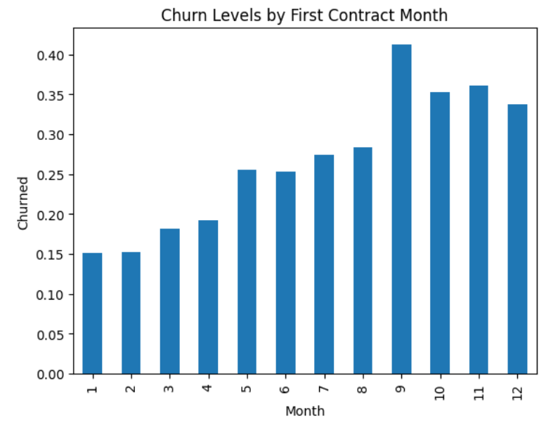
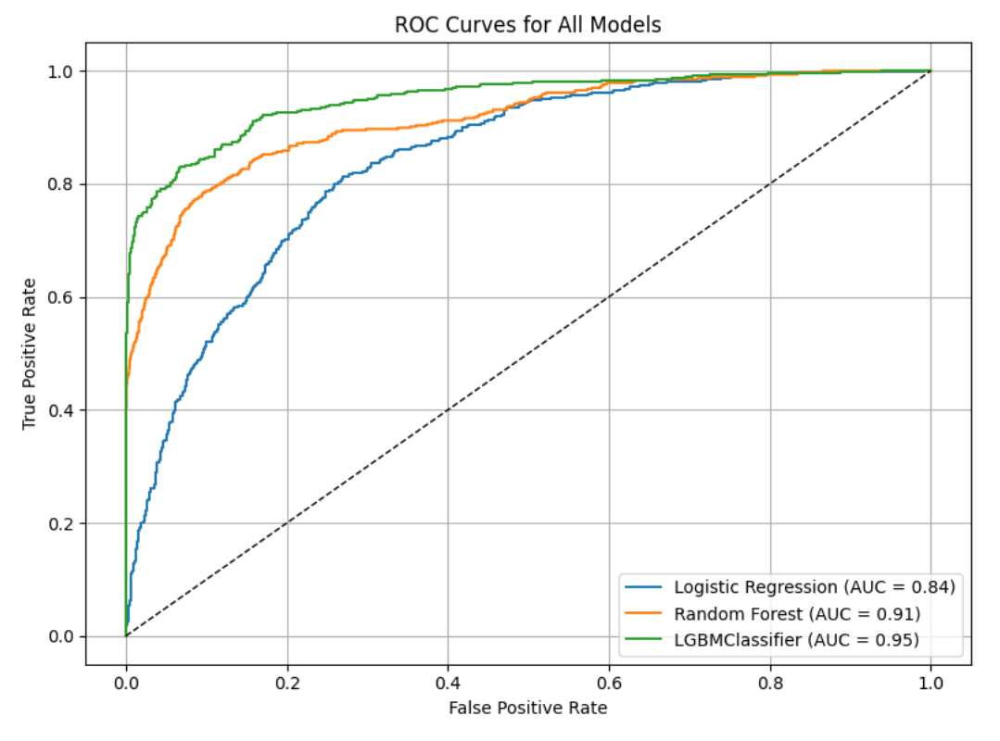

# Sprint 17 Project: Final Project

---

### 📚 Table of Contents
- 🔍 [Project Overview](#project-overview)
- 📈 [Conclusion](#conclusion)
- 🖼️ [Sample Outputs](#sample-outputs)
- 📁 [Files](#files)

---

## Project Overview

The telecom operator Interconnect would like to be able to forecast their churn of clients. If it's discovered that a user is planning to leave, they will be offered promotional codes and special plan options. Interconnect's marketing team has collected some of their clientele's personal data, including information about their plans and contracts.

---

## Conclusion

This project set out to build a machine learning model for the telecom operator Interconnect to help them predict and prevent customer churn.

The work plan I prepared was followed as expected without any significant difficulty. I loaded and merged four files containing data about customer contracts, personal information, internet services, and phone service. The data were relabeled, converted to appropriate file types, and properly formatted. Missing data were filled, useful features were extracted from dates (month and contract tenure), categorical features were one-hot encoded, and continuous features were scaled. After dropping extraneous columns, 23 features (4 continuous and 19 binary) remained in addition to one target: 1 for churned, 0 for not churned. All the features were suitable for modeling; none contained outliers, extreme distributions, or unreasonable class balances. To address the fairly large target class imbalance, with 73% having not churned, I used a primary metric robust to such imbalances (AUC-ROC) and requested compensatory internal class weights for each model with the class_weight='balanced' hyperparameter.

I trained three models with cross-validation: logistic regression, random forest classifier, and gradient boosted decision tree (LGBMClassifier). The logistic regression was an adequate baseline model (AUC-ROC = 0.841). After tuning five hyperparameters each, scores for the random forest (AUC-ROC = 0.913) and LGBMClassifier (AUC-ROC = 0.949) models were very good. Testing on the hold-out test data confirmed the ranking and quality of the models: logistic regression (AUC-ROC = 0.840, accuracy = 0.758), then random forest (AUC-ROC = 0.913, accuracy = 0.877), and finally LGBMClassifier (AUC-ROC = 0.950, accuracy = 0.902). The latter two models far surpassed the project goal of AUC-ROC > 0.88. The final LGBMClassifier was the best model overall, correctly predicting whether someone churned 90% of the time, and is my recommended solution for Interconnect.

This model can help Interconnect with its goal of preventing churn by identifying customers who have not yet churned but were assigned high probabilities by the model. By offering promotions, discounts, or even just encouragement to ongoing customers who resemble past churners, Interconnect might be able to catch them before they churn. That is a defensible approach as long as the model is periodically retrained on updated data to remain accurate. However, there is a mismatch between this model and the true objective. The model predicts customers who have already churned, not those who are about to churn. A better approach would be to train a time series model based on monthly customer data and churn dates. That would allow Interconnect to actually forecast churning ahead of time based on behavioral patterns, not a single static profile. For example, churn might occur after three months of declining charges, a spike in support calls, or the end of a two-year contract. The model from this project cannot take those dynamic factors into account. A time series model would be more complex but worth exploring if the data is available.

---

## Sample Outputs

Here are two key moments from the analysis:

  
*Customers who signed up in late summer and fall are much more likely to churn, especially those starting in September.*

 

  
*The LGBMClassifier outperforms logistic regression and random forest, achieving an AUC of 0.95 on the test set.*

---

## Files

📄 See the full analysis in [`sprint-17-project.ipynb`](./sprint-17-project.ipynb)  
📄 Or view a static version in [`sprint-17-project.html`](./sprint-17-project.html)  
📄 Project background: [`project-description.md`](./project-description.md)

> Note: This project uses four CSV files, all of which are included in the `/data/` folder.  
> See [`/data/README.md`](./data/README.md) for details.
